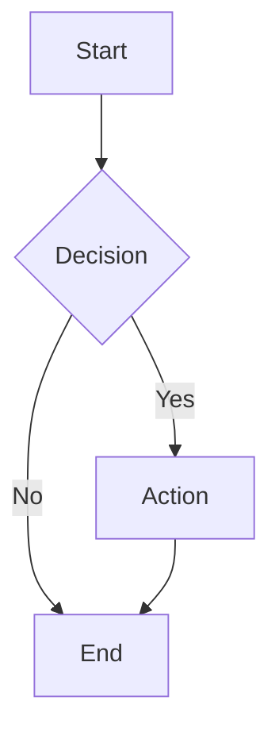

# Beautiful Mermaid Playground — Design Spec

## Overview

A single-page playground app for the `beautiful-mermaid` npm package. Users write Mermaid diagram code in a Monaco editor and see a live SVG or ASCII preview. Built with Next.js 15 (App Router), shadcn (radix-nova), Tailwind CSS v4, and next-themes for dark/light/system mode.

## Layout

```
┌─────────────────────────────────────────────┐
│ Navbar: [Title]              [Theme] [GitHub]│
├──────────────────────┬──────────────────────┤
│                      │ [SVG | ASCII]  [Copy]│
│   Monaco Editor      │ [Download] (SVG only)│
│   (mermaid input)    │                      │
│                      │   Preview area       │
│                      │   (scrollable)       │
│                      │                      │
└──────────────────────┴──────────────────────┘
```

Full viewport height. Editor and preview each take 50% width.

## Components

### Navbar (`src/components/navbar.tsx`)
- Left: app title "Beautiful Mermaid Playground"
- Right: theme toggle (dark/light/system via `next-themes` `useTheme`) + GitHub icon link to `https://github.com/lukilabs/beautiful-mermaid`
- Uses shadcn `button` for icon buttons

### MermaidEditor (`src/components/mermaid-editor.tsx`)
- Monaco editor via `@monaco-editor/react`
- Language mode: mermaid (or plain text if mermaid grammar unavailable)
- Fills available height
- Adapts theme to light/dark mode (vs-dark / light)
- Calls `onChange` callback with new text value

### MermaidPreview (`src/components/mermaid-preview.tsx`)
- Props: `svgOutput: string`, `asciiOutput: string`, `mode: 'svg' | 'ascii'`, `onModeChange`, `error: string | null`
- Top toolbar: toggle group (SVG | ASCII), copy button, download button (SVG mode only)
- SVG mode: renders SVG via `dangerouslySetInnerHTML` in a scrollable container
- ASCII mode: renders HTML-colored ASCII in a `<pre>` block
- Error state: displays error message when rendering fails
- Uses shadcn `toggle-group`, `button`, `tooltip`

### Page (`src/app/page.tsx`)
- Client component (`"use client"`)
- Owns state: `mermaidText`, `svgOutput`, `asciiOutput`, `previewMode`, `error`
- Debounced rendering: 300ms debounce on typing, immediate on paste
- Calls `renderMermaidSVG(text, { bg: 'var(--background)', fg: 'var(--foreground)', transparent: true })` for SVG
- Calls `renderMermaidASCII(text, { colorMode: 'html' })` for ASCII with HTML color spans
- Copy: raw SVG string or plain ASCII text (re-render with `colorMode: 'none'` for copy)
- Download: creates Blob from SVG string, triggers download as `.svg`

## Dependencies to Add

- `next-themes` — dark/light/system theme provider
- `@monaco-editor/react` — Monaco editor React wrapper

## shadcn Components to Add

- `button`
- `toggle-group`
- `tooltip`

## Default Example



## Theme Integration

- `next-themes` `ThemeProvider` wraps the app in `layout.tsx` with `attribute="class"`, `defaultTheme="system"`, `enableSystem`
- Monaco editor switches between `vs-dark` and `light` themes based on `resolvedTheme`
- SVG rendering uses CSS variables so diagrams adapt automatically
- ASCII rendering uses `colorMode: 'html'` for styled terminal-like output

## Debounce Behavior

- On typing: 300ms debounce before re-rendering
- On paste: immediate render (detected via Monaco `onDidPaste` or by checking if change is multi-character insert)
- Both SVG and ASCII are rendered together to keep them in sync
